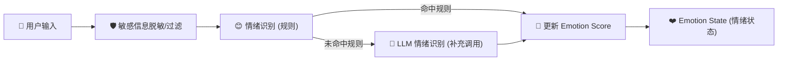
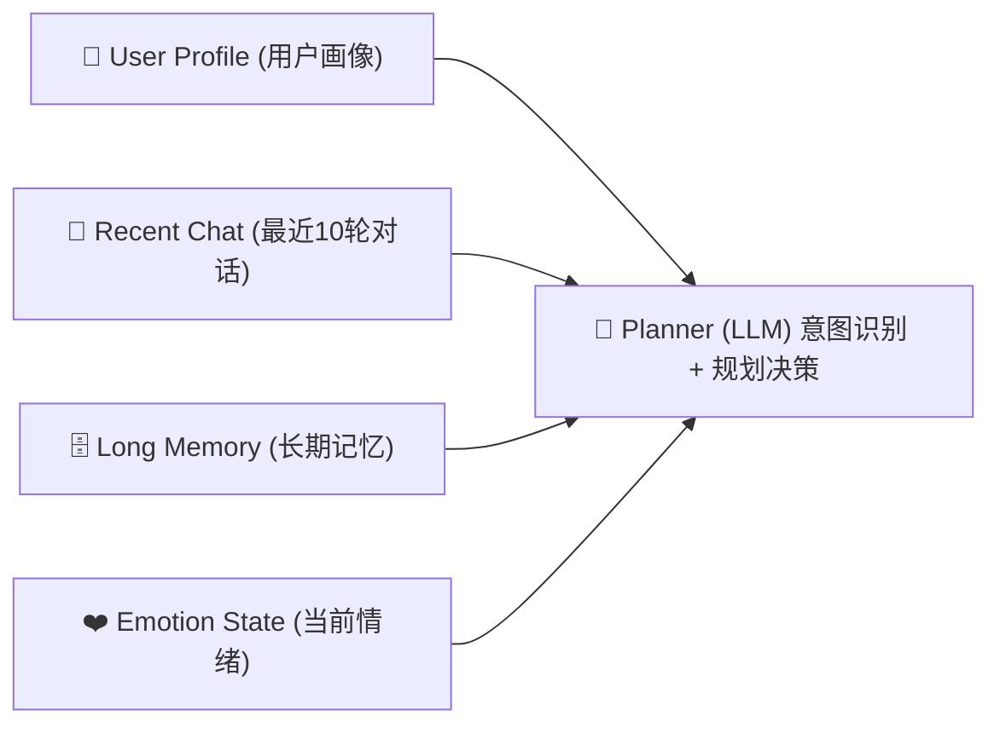
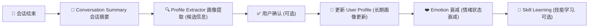
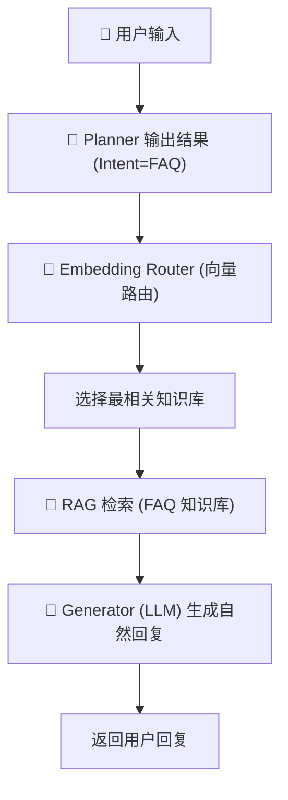
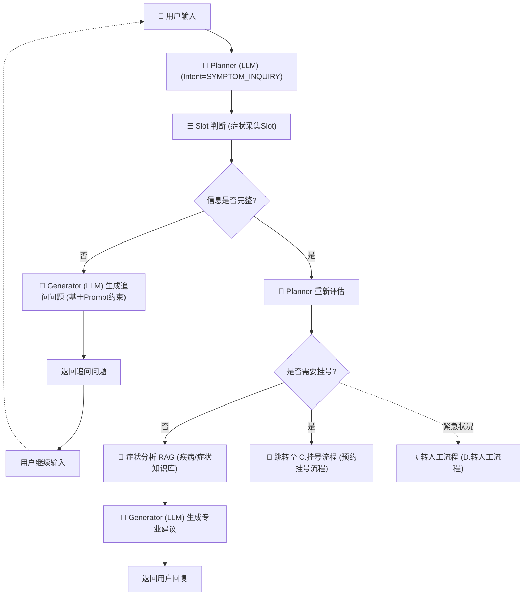
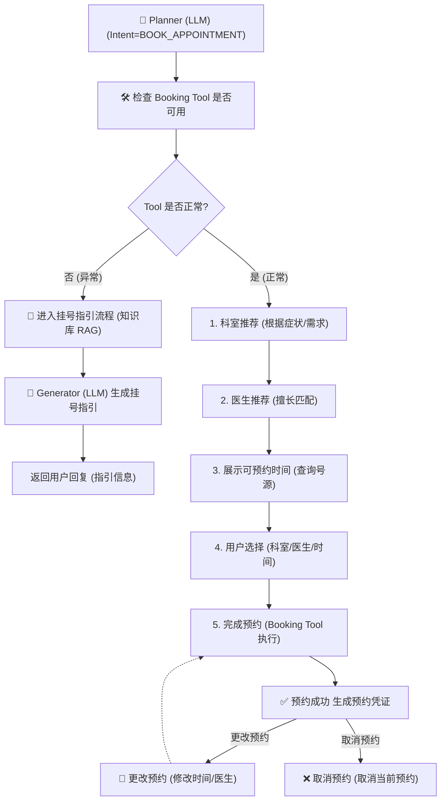
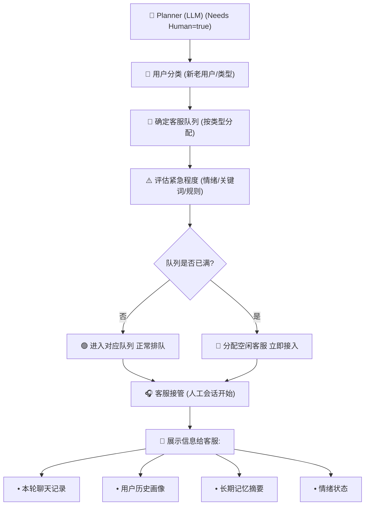

# 医院智慧客服系统 (Hospital Smart Customer Service System)

## 项目简介

本系统是一个基于 **Spring Boot 3 + LangChain4j** 构建的医院智慧客服后端系统。系统集成了 AI Agent 智能导诊、情绪感知、RAG 知识检索、自动转人工等能力，为患者提供智能、高效、有温度的在线客服体验。

### 核心功能

| 模块 | 说明 |
|------|------|
| **AI Agent 智能导诊** | 基于 LangChain4j Agent 框架，自动识别用户意图，调用预约、挂号、查询科室/医生等工具完成服务 |
| **情绪感知引擎** | 实时分析用户情绪状态，支持规则+LLM 混合分析，情绪值达阈值自动转人工 |
| **RAG 知识检索** | 多知识库向量检索（text-embedding-v1），为 AI 回答提供专业医疗知识支撑 |
| **转人工服务** | 当 AI 无法解决或用户情绪恶化时，自动/手动转接人工客服 |
| **用户画像** | 自动提取并学习用户特征，支持画像候选与审核流程 |
| **技能学习** | Agent Tool 事件记录与定时挖掘，自动沉淀高频问答模式 |
| **对话管理** | 多轮对话记忆、会话摘要、情绪摘要归档 |
| **基础业务** | 科室/医生/公告管理、预约挂号、用户评价等 |

### 技术栈

| 类别 | 技术 |
|------|------|
| 框架 | Spring Boot 3.5.15、Java 17 |
| ORM | MyBatis-Plus 3.5.12 |
| 数据库 | MySQL + Druid 连接池 |
| 缓存 | Redis（情绪热状态、会话缓存） |
| AI 引擎 | LangChain4j 1.0.0-beta1 + 阿里云 DashScope（通义千问） |
| API 文档 | Knife4j 4.5.0（OpenAPI 3） |
| 认证 | JWT（jjwt 0.12.6） |
| 工具 | Lombok |

---
## 核心流程图

### 情绪识别与状态更新



### 意图识别与规划决策



### 会话结束与后置处理



---

## 具体业务子流程

### A. FAQ 问答流程



### B. 症状咨询流程 (多轮问诊)



### C. 预约挂号流程



### D. 转人工流程


---

## 项目结构

```
src/main/java/com/studyback/hospitalservicesystem/
├── HospitalServiceSystemApplication.java          # 启动类
│
├── agent/                                          # ── AI Agent 模块 ──
│   ├── aggregator/
│   │   └── ContextAggregator.java                  #   多源上下文聚合（用户画像+记忆+情绪）
│   ├── config/
│   │   ├── AgentFeatureToggle.java                 #   Agent 功能开关
│   │   ├── AgentProperties.java                    #   Agent 配置属性
│   │   ├── EmotionProperties.java                  #   情绪引擎配置属性
│   │   └── LangChain4jConfig.java                  #   LangChain4j 初始化配置
│   ├── dto/                                        #   Agent 数据传输对象
│   │   ├── ActionPlan / PlannedAction.java         #     动作计划
│   │   ├── AgentContext / AgentResponse.java       #     上下文 & 响应
│   │   ├── AppointmentVO.java                      #     预约视图
│   │   ├── EmotionAnalysis / EmotionSignal / EmotionState.java  # 情绪相关 DTO
│   │   ├── HandoffDecision.java                    #     转人工决策
│   │   └── ToolResult.java                         #     工具调用结果
│   ├── emotion/                                    #   情绪感知引擎
│   │   ├── EmotionAnalyzer.java                    #     情绪分析接口
│   │   ├── HybridEmotionAnalyzer.java              #     混合分析实现（规则+LLM）
│   │   ├── EmotionStateService / Impl.java         #     情绪状态管理（Redis）
│   │   ├── EmotionStateRepository / RedisImpl.java #     情绪状态持久化
│   │   └── EmotionStateFlushScheduler.java         #     定时刷盘调度
│   ├── generator/
│   │   └── AnswerGeneratorService / Impl.java      #   AI 回答生成服务
│   ├── handoff/
│   │   └── HandoffDecisionService.java             #   转人工决策服务
│   ├── memory/
│   │   ├── ChatMemoryService / Impl.java           #   多轮对话记忆（窗口滑动）
│   │   └── UserMemoryService / Impl.java           #   用户长期记忆
│   ├── orchestrator/
│   │   └── AgentOrchestrator.java                  #   Agent 总编排器（主流程入口）
│   ├── planner/
│   │   └── IntentPlannerService / Impl.java        #   意图规划（LLM 意图识别+动作规划）
│   ├── profile/
│   │   ├── ConversationLearningService.java        #   对话学习服务
│   │   ├── ConversationSummaryService.java         #   会话摘要服务
│   │   └── ProfileCandidateExtractor.java          #   用户画像候选提取
│   ├── rag/                                        #   RAG 检索增强生成
│   │   ├── EmbeddingRouterService / Impl.java      #     向量路由（查询分类→知识库选择）
│   │   ├── MultiKBRetrievalService / Impl.java     #     多知识库检索
│   │   ├── VectorStore / InMemoryVectorStore.java  #     内存向量存储
│   ├── skill/                                      #   技能学习模块
│   │   ├── SkillMatcher.java                       #     技能匹配器
│   │   ├── SkillMiningService / Scheduler.java     #     技能挖掘（定时任务）
│   │   ├── SkillRegistryService.java               #     技能注册表
│   │   └── ToolEventRecorder.java                  #     工具事件记录
│   ├── tool/                                       #   Agent 工具集
│   │   ├── BookingTool.java                        #     预约工具
│   │   ├── DepartmentTool.java                     #     科室查询工具
│   │   ├── DoctorTool.java                         #     医生查询工具
│   │   ├── RegisterTool.java                       #     挂号工具
│   │   ├── ReportTool.java                         #     报告查询工具
│   │   ├── ScheduleTool.java                       #     排班查询工具
│   │   └── ToolRegistry.java                       #     工具注册中心
│   └── type/                                       #   枚举类型
│       ├── ActionType / EmotionType / IntentType.java
│       ├── KnowledgeBaseType.java
│       └── WizardStep.java
│
├── common/                                         # ── 通用组件 ──
│   ├── PageResult.java                             #   分页结果封装
│   └── Result.java                                 #   统一响应封装
│
├── config/                                         # ── 全局配置 ──
│   ├── CorsConfig.java                             #   跨域配置
│   ├── DashScopeConfig.java                        #   DashScope 配置
│   ├── GlobalExceptionHandler.java                 #   全局异常处理
│   ├── JacksonConfig.java                          #   JSON 序列化配置
│   ├── JwtAuthFilter.java                          #   JWT 认证过滤器
│   ├── JwtUtil.java                                #   JWT 工具类
│   ├── Knife4jConfig.java                          #   API 文档配置
│   └── MyBatisPlusConfig.java                      #   MyBatis-Plus 配置
│
├── controller/                                     # ── 控制器层 ──
│   ├── AgentController.java                        #   AI Agent 对话入口
│   ├── AgentSkillController.java                   #   Agent 技能管理
│   ├── AnnouncementController.java                 #   公告管理
│   ├── AppointmentController.java                  #   预约管理
│   ├── AuthController.java                         #   登录/注册/Token 刷新
│   ├── ConversationController.java                 #   对话管理
│   ├── DepartmentController.java                   #   科室管理
│   ├── DoctorController.java                       #   医生管理
│   ├── HumanAgentController.java                   #   人工客服
│   ├── KnowledgeBaseController.java                #   知识库管理
│   ├── MessageController.java                      #   消息管理
│   ├── RatingController.java                       #   评价管理
│   ├── UserController.java                         #   用户管理
│   └── UserProfileController.java                  #   用户画像
│
├── dto/                                            # ── 数据传输对象 ──
│   ├── AppointmentRequest.java                     #   预约请求
│   ├── HandoffContextResponse.java                 #   转人工上下文响应
│   ├── HumanServiceResult.java                     #   人工服务结果
│   ├── LoginRequest / LoginResponse.java           #   登录请求/响应
│   ├── QARequest / QAResponse.java                 #   问答请求/响应
│   ├── RefreshRequest.java                         #   Token 刷新请求
│   └── TimeSlotVO.java                             #   时段视图
│
├── entity/                                         # ── 数据库实体 ──
│   ├── User / UserProfile / UserMemory.java        #   用户相关
│   ├── Department / Doctor.java                    #   科室 & 医生
│   ├── Appointment / Rating.java                   #   预约 & 评价
│   ├── Conversation / Message.java                 #   对话 & 消息
│   ├── ConversationSummary / ConversationEmotionSummary.java  # 摘要
│   ├── Announcement / KnowledgeBase.java           #   公告 & 知识库
│   ├── AgentSkill / AgentToolEvent.java            #   Agent 技能 & 工具事件
│   ├── CsStaffProfile.java                         #   客服人员画像
│   ├── HumanHandoffRequest.java                    #   转人工请求
│   └── UserProfileCandidate.java                   #   用户画像候选
│
├── mapper/                                         # ── MyBatis-Plus Mapper ──
│   └── （与 entity 一一对应，共 17 个 Mapper）
│
└── service/                                        # ── 业务服务层 ──
    ├── UserService / UserProfileService             #   用户 & 画像
    ├── DepartmentService / DoctorService            #   科室 & 医生
    ├── AppointmentService / RatingService           #   预约 & 评价
    ├── ConversationService / MessageService         #   对话 & 消息
    ├── AnnouncementService / KnowledgeBaseService   #   公告 & 知识库
    ├── HandoffContextService / HumanAgentService    #   转人工 & 人工客服
    ├── PrivacyProtectionService                     #   隐私保护
    └── impl/                                        #   对应实现类（共 13 个）
```

---

## 快速开始

### 环境要求

- JDK 17+
- MySQL 8.0+
- Redis 6.0+
- Maven 3.8+

### 1. 配置数据库

创建数据库并导入初始数据：

```sql
CREATE DATABASE hospitalservicesystem DEFAULT CHARACTER SET utf8mb4;
USE hospitalservicesystem;
SOURCE seed_data.sql;
```

### 2. 修改配置

编辑 `src/main/resources/application.yml`，修改数据库连接、Redis 地址、DashScope API Key 等配置。

### 3. 启动项目

```bash
# 方式一：Maven 启动
./mvnw spring-boot:run

# 方式二：打包后运行
./mvnw clean package -DskipTests
java -jar target/HospitalServiceSystem-0.0.1-SNAPSHOT.jar
```

---

## Agent 架构说明

系统采用 **Orchestrator 编排模式**，核心流程如下：

```
用户消息
  │
  ▼
AgentOrchestrator（总编排）
  ├── ContextAggregator ── 聚合用户画像 + 对话记忆 + 情绪状态
  ├── IntentPlanner ───── LLM 识别意图，生成动作计划
  ├── ToolExecutor ────── 执行预约/查询/挂号等工具
  ├── EmotionAnalyzer ─── 规则+LLM 混合情绪分析
  ├── RAG Retriever ───── 多知识库向量检索
  ├── AnswerGenerator ─── LLM 生成最终回答
  └── HandoffDecision ─── 判断是否需要转人工
```

---

## 许可证

